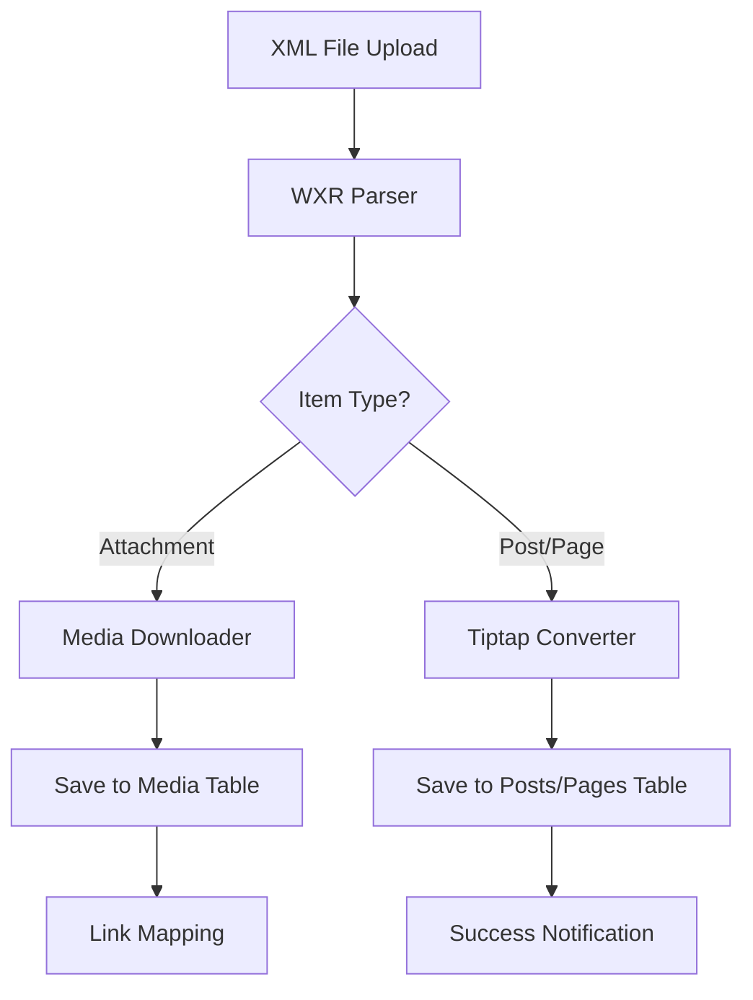

# 🛠️ Arsitektur Tools Jala Warta: Interoperabilitas WordPress

Dokumen ini merinci strategi teknis untuk fitur **Tools**, yang memungkinkan pengguna untuk melakukan Ekspor dan Impor data (Post, Page, Media) dari platform eksternal, dimulai dengan WordPress.

---

## 🏗️ 1. Arsitektur Importer (WordPress WXR)

Jala Warta menggunakan format **WordPress eXtended RSS (WXR)** sebagai jembatan utama. Proses import akan mengikuti pipeline berikut:

### A. Parsing Layer (XML to Object)
- Menggunakan pustaka parser XML yang handal untuk menangani format RSS 2.0 dengan namespace khusus (`wp`, `content`, `excerpt`, `dc`).
- Ekstraksi elemen kunci:
    - `<item>`: Node utama untuk Post, Page, dan Attachment.
    - `wp:post_type`: Menentukan target tabel di Jala Warta.
    - `wp:post_meta`: Mencari data SEO (misal: `_yoast_wpseo_title`) dan data pendukung lainnya.

### B. Content Mapping (HTML to Tiptap JSON)
Ini adalah bagian terpenting karena perbedaan format penyimpanan:
- **WordPress**: Menyimpan dalam blok HTML (`wp-block-*` jika menggunakan Gutenberg).
- **Jala Warta**: Menyimpan dalam struktur JSON Tiptap.
- **Strategi**: Implementasi `DOMParser` di sisi server untuk mengubah string HTML menjadi kontainer nodes yang kompatibel dengan skema Tiptap Jalawarta.

### C. Media Library Sync & Link Replacement
- **External Image Fetching**: Setiap `attachment` di XML akan memicu pengunduhan file fisik dari URL asal.
- **Relational Integrity**: Setelah media tersimpan di Jala Warta, `id` atau `url` baru akan dipetakan kembali ke pos yang merujuknya.
- **Featured Image**: Mapping metakey `_thumbnail_id` untuk mengisi kolom `featuredImage` pada tabel `posts`.

---

## 📤 2. Arsitektur Exporter

Fitur ekspor akan menghasilkan file XML yang kompatibel dengan standar WordPress, sehingga pengguna dapat memindahkan data dari Jalawarta ke WordPress jika diperlukan.

### A. Data Retrieval
- Query database berdasarkan `tenantId`.
- Mendukung filter (Post Type, Status, Range Tanggal).

### B. Serialization Layer (Object to XML)
- Konversi Tiptap JSON kembali ke HTML clean.
- Pembungkusan data dalam struktur XML WXR dengan namespace yang tepat.
- Metadata `seo_config` akan diekspor sebagai `wp:postmeta` yang kompatibel dengan plugin SEO populer.

---

## 🎨 3. UI/UX: Dashboard Tools

Antarmuka akan mengadopsi kemudahan penggunaan WordPress namun dengan estetika Jala Warta yang premium.

### A. Layout `/app/app/tools`
- **Dashboard**: Panel ringkasan statistik (Jumlah Pos/Media yang tersedia).
- **Import Screen**:
    - Area "Drop zone" untuk file XML.
    - Progress bar real-time (karena import media bisa memakan waktu lama).
    - Log detail progres (berapa yang sukses/gagal).
- **Export Screen**:
    - Opsi radio button: "All Content", "Posts Only", "Pages Only", atau "Media Only".
    - Tombol "Download Export File".

---

## 🛠️ 4. Teknis Implementasi (Core Logic)

### Keamanan & Performa:
1. **Memory Handling**: Menggunakan *streaming parser* jika file XML sangat besar (>50MB).
2. **Transaction Integrity**: Menggunakan transaksi database agar jika import gagal di tengah jalan, data tidak menjadi "kotor".
3. **Queue Mechanism**: Direkomendasikan menggunakan asinkronus processing jika jumlah media sangat banyak.

---

## ✅ 5. Hasil Implementasi & Struktur Kode

Fitur **Tools** telah berhasil diimplementasikan dengan struktur file sebagai berikut:

### A. Engine Utama (`src/lib`)
- [x] **`src/lib/converters/content-engine.ts`**: Mesin transformasi yang menangani konversi HTML (WordPress) ke Tiptap JSON (Jala Warta) menggunakan `jsdom` dan `@tiptap/html`.
- [x] **`src/lib/importers/wordpress.ts`**: Parser XML WXR yang mendownload media eksternal secara asinkron, memetakan kategori/tag, dan menyuntikkan data ke database.
- [x] **`src/lib/exporters/wordpress.ts`**: Generator XML WXR yang mengubah data Jala Warta kembali ke format standar WordPress untuk interoperabilitas penuh.

### B. Antarmuka Pengguna (`src/app/app/tools`)
- [x] **Dashboard (`/tools`)**: Panel kendali utama dengan desain premium.
- [x] **Import (`/tools/import`)**: Antarmuka unggah file dengan progress tracker dan log error yang mendetail.
- [x] **Export (`/tools/export`)**: Panel filter ekspor (All, Posts, Pages, Media) dengan fitur unduhan langsung.

---

> [!IMPORTANT]
> **Catatan Teknis Akhir:**
> 1. **Data Integrity**: Fungsi ekspor dan impor dirancang secara *non-destructive*, artinya data di database tujuan hanya akan ditambahkan dan tidak akan menghapus data yang sudah ada (kecuali terjadi konflik slug).
> 2. **Media Sync**: Proses impor media sangat bergantung pada koneksi server asal. Jika server WordPress lama sudah mati, gambar mungkin gagal diunduh dan akan dicatat dalam log kesalahan.
> 3. **Format**: Standar XML WXR 1.2 digunakan untuk memastikan kompatibilitas maksimal.

---

> [!TIP]
> **Status:** Implementasi Selesai (v1.0).
