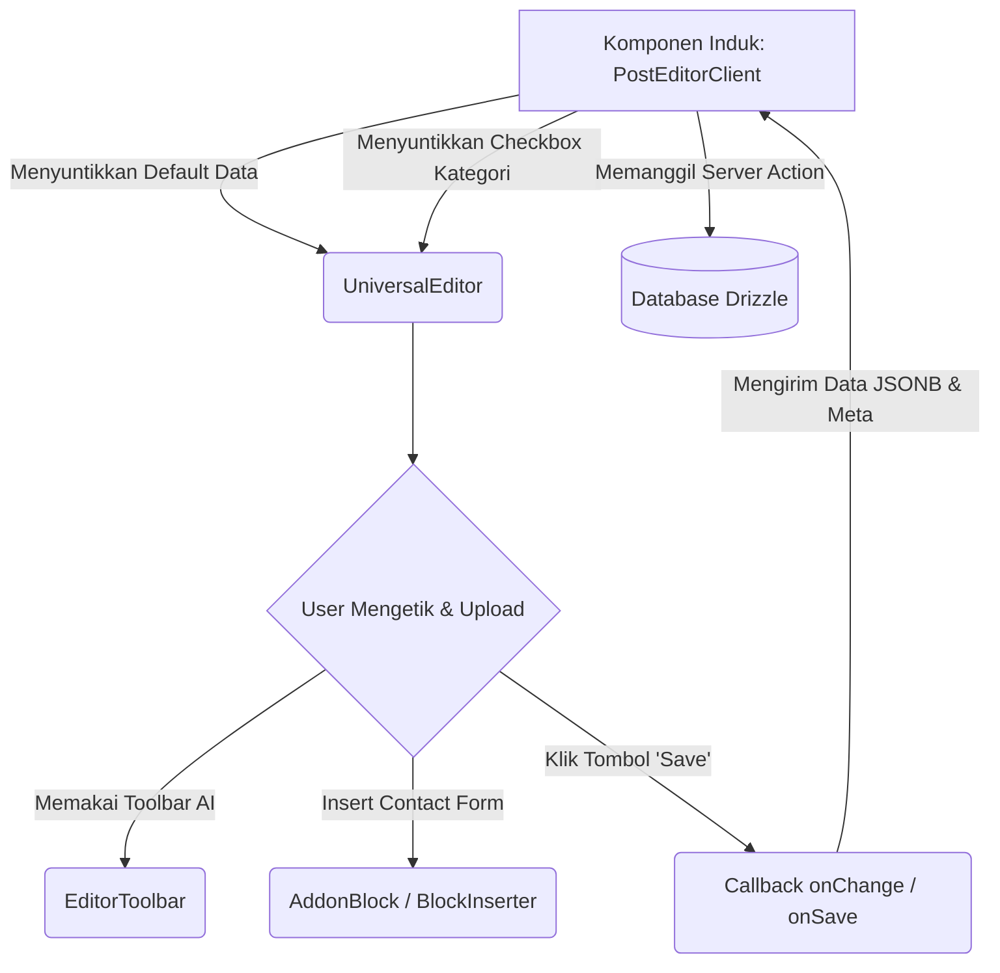

# Arsitektur Universal Block Editor (Tiptap)

Dokumen ini adalah referensi pengembangan untuk penyusunan Editor Artikel Universal di Jalawarta. Target dari arsitektur ini adalah membangun satu mesin WYSIWYG tunggal yang bersifat *stateless* terhadap tipe konten, menjadikannya komponen *reuseable* untuk Pages, Posts, Products, dll.

## 1. Filosofi Modular (Decoupling)
Sebelumnya, komponen *PostEditorClient.tsx* tercampur baur dengan data yang dikhususkan pada entitas tabel `posts` (seperti Kategori, Tag).
Saat refactoring, kita memecah fungsionalitas tersebut:
- **`UniversalEditor`**: Modul murni yang hanya menerima nilai (teks, judul, _featured image_), menangani mekanika UI editor, dan melempar *callback* ke komponen induk saat tombol "Simpan" ditekan. Komponen ini TIDAK BOLEH memanggil _Server Actions_ eksekutor database (seperti `savePost()`) di dalam kodenya.
- **Komponen Induk (Cth: `PostEditor` / `PageEditor`)**: Ini adalah komponen pembungkus tempat `UniversalEditor` bernapas. Tugasnya memanggil *fetch API*, mendefinisikan URL/ID, memuat panel _sidebar_ tambahan (misal Panel Tag), dan menangani pengiriman form.

## 2. Struktur Komponen Tiptap

Ekosistem Universal Editor akan berbentuk keranjang bersarang (_Nested Components_):

### `UniversalEditor.tsx` (Root/Induk)
Berisi layout *grid* raksasa (Area Ketik kiri, Panel *Sidebar* kanan). Komponen ini menjaga state global halaman editor (`title`, `slug`, `content JSON`).

### `EditorToolbar.tsx` (Sub-komponen)
Demi kebersihan kode, semua deretan tombol format (Bold, Italic, Headings), injeksi *Block Inserter* (Placeholder UI Addons), hingga fungsi *AI Generative* (*Fix* dan *Expand*) dilokalisasi di sini.

### `Sidebar` Papan Kontrol Tiptap
1. **Kotak Publikasi (Wajib/Built-In)**: Memiliki status status pengiriman. Menangani tombol *Simpan Draft* dan *Publikasikan*.
2. **Featured Image (Wajib/Built-In)**: Integrasi pratinjau thumbnail yang terkait erat dengan modul *MediaLibrary* bawaan editor.
3. **SEO Panel (Injeksi Wajib)**: Alat manajemen _og:image_, konfigurasi mesin telusur bawaan.
4. **Slot Tambahan (Opsional/Children)**: Menerima elemen `children` dari komponen React induk, tempat dimana "Panel Kategori", "Panel Etalase Produk", atau metadata rumit lainnya bisa diletakkan tanpa harus ditulis secara _hardcode_ di `UniversalEditor.tsx`.

## 3. Ekstensi Custom Tiptap
Tiptap tidak boleh hanya mendukung manipulasi teks HTML. Di Jalawarta, kita memasang komponen _ReactNodeView_ untuk membawa Add-on eksternal ke dalam area teks.
- **AddonBlockExtension**: Menerjemahkan node Tiptap spesifik dan ID add-on.
- **AddonNodeView**: Blok visual Placeholder yang ter-render di atas kanvas editor. Meniadakan penggunaan *shortcode* kotor.

## 4. Alur Kerja (Workflow Diagram)



## 5. Studi Kasus Implementasi Ekstensi (Pages vs Posts)

Berkat arsitektur modular di atas, apabila kita ingin membuat Tipe Konten baru (misal Laman Statis/Page yang tidak butuh taksonomi Kategori dan Tag sama sekali), kode di komponen Pembungkus (*Wrapper*) cukup sesingkat ini:

```tsx
// PageEditorClient.tsx
import UniversalEditor from "./UniversalEditor";
import { savePage } from "@/app/actions/pages";

export default function PageEditorClient({ tenantId, defaultTitle }) {
  return (
    <UniversalEditor
      tenantId={tenantId}
      defaultTitle={defaultTitle}
      onSave={async (data, status) => {
        // Hanya panggil Server Action yang cocok dengan tabel `pages`
        const result = await savePage({
          tenantId,
          title: data.title,
          slug: data.slug,
          content: data.content, // JSON
          featuredImage: data.featuredImage, // String URL
        });
        return { success: result.success, error: result.error };
      }}
      // sidebarPanels={...} Tidak di-define, sehingga UI tetap rapih tanpa error panel kosong
    />
  );
}
```

Seperti ditunjukkan di atas, kita mereduksi ratusan baris duplikasi WYSIWYG editor menjadi murni konfigurasi *data fetching*.

---
*Arsitektur ini didesain agar Jalawarta memiliki CMS Editor bertaraf enterprise tanpa menyebabkan redudansi memori.*
