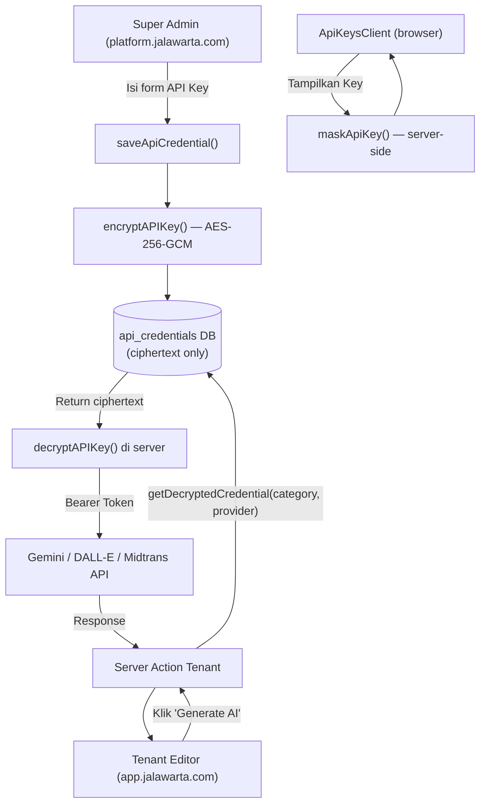

# Arsitektur Master Credential & API Vault — Jalawarta (Next.js)

Dokumen ini merupakan referensi teknis definitif untuk sistem manajemen kunci API tersentralisasi di ekosistem SaaS Multi-Tenant Jalawarta. Implementasi ini diadaptasi dari pola AneWP/Jalaseo (Laravel) ke dalam stack modern **Next.js 15, Drizzle ORM, dan PostgreSQL**.

---

## 1. Filosofi & Topologi Keamanan

Sesuai prinsip **SaaS Network Segregation** di `docs/15-arsitektur-domain-topologi.md`, seluruh manajemen API Key hanya dapat diakses melalui `platform.jalawarta.com`.

| Lapisan Keamanan | Implementasi |
|---|---|
| **Proxy (Middleware)** | `src/proxy.ts` — hanya trafik `platform.*` dengan `jw_session` valid yang diteruskan |
| **Layout Guard** | `src/app/platform/layout.tsx` — verifikasi `role === PLATFORM_ADMIN` setiap request |
| **Server Action Guard** | `verifySuperAdmin()` wajib dipanggil di **setiap** fungsi `saveApiCredential`, `deleteApiCredential` |
| **Enkripsi Data** | AES-256-GCM via `src/lib/encryption.ts` — plaintext *tidak pernah* menyentuh database |
| **Display Masking** | `maskApiKey()` — format `AIza••••••••••••7890`, masking terjadi di server sebelum dikirim ke browser |

---

## 2. Struktur File Implementasi

```
src/
├── lib/
│   ├── encryption.ts         # Utilitas kriptografi AES-256-GCM
│   └── api-categories.ts     # Konstanta kategori & provider (shared, non-server)
├── app/
│   ├── actions/
│   │   └── apikeys.ts        # Server Actions: saveApiCredential, deleteApiCredential, getDecryptedCredential
│   └── platform/
│       └── api-keys/
│           └── page.tsx      # Server Component: fetch + mask sebelum render
└── components/
    └── platform/
        └── ApiKeysClient.tsx # Client Component: UI Vault (form, list, toggle)
```

---

## 3. Skema Database (`api_credentials`) — Drizzle ORM

Tabel ini terdaftar di `src/db/schema.ts`.

```typescript
export const apiCredentials = pgTable("api_credentials", {
  id: text("id").primaryKey().$defaultFn(() => crypto.randomUUID()),
  category: text("category").notNull(),    // Kunci kategori, cth: 'ai_text_generation'
  provider: text("provider").notNull(),    // Kunci provider, cth: 'gemini'
  apiKey: text("api_key").notNull(),       // SELALU terenkripsi AES-256-GCM
  apiSecret: text("api_secret"),           // Terenkripsi, nullable (Client Secret, dsb)
  displayName: text("display_name").notNull(),
  description: text("description"),
  isActive: boolean("is_active").default(true),
  lastVerifiedAt: timestamp("last_verified_at"),
  createdAt: timestamp("created_at").defaultNow(),
  updatedAt: timestamp("updated_at").defaultNow(),
}, (t) => ({
  // UNIQUE constraint: satu provider per kategori
  categoryProviderIdx: uniqueIndex("api_cred_category_provider_idx").on(t.category, t.provider),
}));
```

---

## 4. Mekanisme Kriptografi (AES-256-GCM)

File: `src/lib/encryption.ts`

Menggunakan **AES-256-GCM** (authenticated encryption) — lebih aman dari CBC karena mendeteksi tampering lewat Auth Tag.

Kunci enkripsi disimpan di `.env`:
```
APP_ENCRYPTION_KEY="<32-byte hex>"   # TERPISAH dari AUTH_SECRET (JWT)
```

> **Mengapa dipisah?** Rotasi `AUTH_SECRET` (JWT) tidak boleh merusak semua API Key yang sudah terenkripsi di database. Dua kunci = dua siklus hidup yang independen.

Format penyimpanan di DB: `iv:authTag:cipherHex` — tiga segmen dipisah titik dua.

| Fungsi | Kegunaan |
|---|---|
| `encryptAPIKey(plain)` | Enkripsi saat simpan ke DB |
| `decryptAPIKey(cipher)` | Dekripsi di Server Action/Component |
| `maskApiKey(plain)` | Format tampilan `AIza••••••••••••7890` untuk UI |

---

## 5. Kategorisasi & Provider

File: `src/lib/api-categories.ts` — sumber tunggal yang diimpor UI dan Server Actions.

| Kategori | Label | Contoh Provider |
|---|---|---|
| `ai_text_generation` | AI Text Generation | `gemini`, `openai_chatgpt`, `claude`, `deepseek`, `perplexity` |
| `ai_image_generation` | AI Image Generation | `gemini_imagen`, `openai_dalle`, `fal_flux`, `midjourney`, `ideogram` |
| `payment_gateway` | Payment Gateway | `midtrans`, `xendit`, `stripe` |
| `analytics` | SEO & Analytics | `google_search_console`, `google_analytics_4`, `dataforseo` |
| `master_pixel` | Marketing Pixel (Master) | `meta_facebook`, `tiktok`, `google_ads` |

---

## 6. Alur Eksekusi (Flowchart)



---

## 7. Routing & Antarmuka (Next.js App Router)

| Rute Virtual (Platform) | Fungsi |
|---|---|
| `GET /platform/api-keys` | Daftar semua kredensial (masked), filter per kategori |
| `POST (Server Action)` | `saveApiCredential()` — create atau update |
| `DELETE (Server Action)` | `deleteApiCredential()` — hapus permanen |

**Catatan penting di edit form:** Field API Key dikosongkan = pertahankan enkripsi lama di DB. Tidak ada satu pun plaintext yang pernah keluar dari server.

---

## 8. Ringkasan Keamanan

| Aspek | Implementasi Jalawarta |
|---|---|
| **Algoritma Enkripsi** | AES-256-GCM (authenticated) |
| **Kunci Enkripsi** | `APP_ENCRYPTION_KEY` (32-byte hex, terpisah dari JWT Secret) |
| **Tempat Enkripsi** | Server-side only (`src/app/actions/apikeys.ts`) |
| **Tempat Dekripsi** | Server-side only — `getDecryptedCredential()` |
| **Display** | Masking di server sebelum dikirim ke Client Component |
| **Error Duplikasi** | Pengecekan eksplisit sebelum INSERT + fallback kode `23505` |
| **Access Control** | `verifySuperAdmin()` di setiap mutating action |

---

*Dokumentasi ini mencerminkan implementasi aktual per April 2026. Perbarui jika ada perubahan skema, provider baru, atau rotasi kunci enkripsi.*
