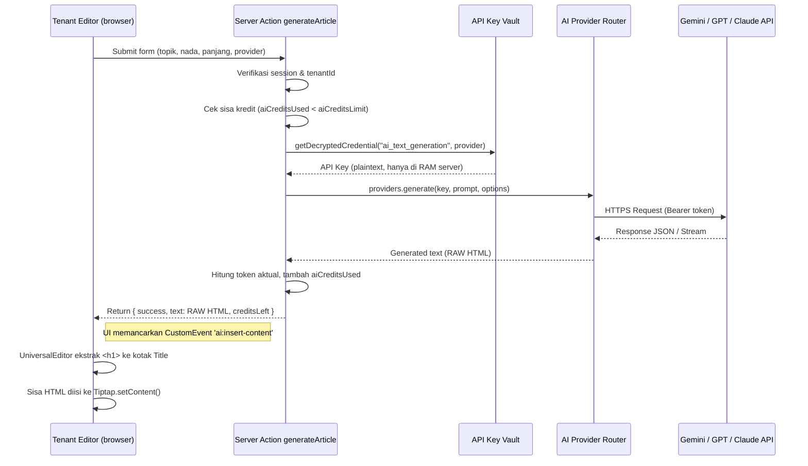

# Arsitektur Add-on: AI Article & Content Generator — Jalawarta

Dokumen ini adalah spesifikasi teknis definitif untuk Add-on **AI Article Generator** pada ekosistem SaaS Multi-Tenant Jalawarta. Rancangan ini mengadaptasi inspirasi dari pola Jalaseo/AneWP Laravel namun **disesuaikan penuh** dengan tumpukan teknis kita: Next.js 15 App Router, Drizzle ORM, Tiptap Editor, dan sistem API Key Vault (`docs/16-arsitektur-platform-apikey.md`).

---

## 1. Identitas Add-on

| Atribut | Nilai |
|---|---|
| **Plugin ID** | `ai-article-generator` |
| **Nama** | AI Article & Content Generator |
| **Deskripsi** | Hasilkan artikel lengkap dan optimalkan konten secara otomatis menggunakan AI (Gemini, ChatGPT, Claude) langsung dari editor Jala Warta. |
| **Kategori** | `ai_text_generation` |
| **Status Default** | `INACTIVE` — harus diaktifkan per tenant |
| **Bergantung Pada** | Setidaknya 1 API Key aktif di kategori `ai_text_generation` di API Key Vault Platform |

---

## 2. Konsep & Filosofi Rancangan

### 2.1 Integrasi dengan API Key Vault

Add-on ini **tidak memiliki API Key sendiri**. Seluruh panggilan AI menggunakan kunci yang sudah tersimpan terenkripsi di sistem **API Key Vault** (`src/app/actions/apikeys.ts`), sesuai prinsip keamanan [SP-05].

Alur: Tenant klik "Generate" → Server Action memanggil `getDecryptedCredential("ai_text_generation", provider)` → Kirim ke API AI → Kembalikan konten.

Tenant **tidak pernah melihat, mengisi, atau mengelola API Key**. Kunci dikelola sepenuhnya oleh Platform Admin.

### 2.2 Prinsip Satu Komponen, Banyak Titik (Single Source UI)

Semua antarmuka AI (panel editor, modal generator, toolbar tombol) **dibungkus dalam satu komponen helper terpusat**: `AiContentPanel`. Jika ada perubahan UI atau logika, cukup edit satu file.

### 2.3 Perhitungan Token & Kuota — Akurat, Anti-Boncos

Penghitungan token dilakukan **berdasarkan respons aktual API**, bukan estimasi.

Setiap provider AI mengembalikan metadata penggunaan token:
- **Gemini**: `usageMetadata.promptTokenCount + candidatesTokenCount`
- **OpenAI**: `usage.prompt_tokens + usage.completion_tokens`
- **Claude**: `usage.input_tokens + usage.output_tokens`

Server Action akan **membaca nilai token aktual ini**, bukan menebak dari karakter. Hasilnya dikonversi ke kredit:

> **1 Kredit = 1.000 token** (input + output, sesudah generate selesai)

Sisa kredit dicatat real-time di `tenantPlugins.config.aiCreditsUsed`. Jika kredit habis, generate diblokir di sisi server (tidak hanya di UI).

**Kredit per Paket Berlangganan** — ditetapkan Platform Admin di `/platform/addons/ai-article-generator`:
- Bisa berbeda per paket (Free = 10 kredit, Pro = 100 kredit, Enterprise = tak terbatas)
- Default saat pertama aktif: **20 kredit**

### 2.4 Progress UI: "Funny Loading Messages"

Alih-alih streaming karakter demi karakter, generate dilakukan one-shot dengan **popup progress bar** yang menampilkan pesan bergantian secara otomatis. Pesan ini:
- Dikonfigurasi Platform Admin di laman Platform (bisa diedit)
- Disimpan di `tenantPlugins global config` atau tabel `platform_settings`
- Default (bisa diubah): *"Thinking...", "Sensing the vibes...", "Brewing something spicy...", "Almost there, hold tight...", "Final polishing..."*

### 2.5 AI Templates

Tenant dapat menyimpan **Template Generasi** untuk mempercepat workflow editorial berulang:

| Field Template | Contoh |
|---|---|
| Nama Template | "Berita Breaking Singkat" |
| Nada | Jurnalistik |
| Panjang | Pendek (400 kata) |
| Bahasa | Indonesia |
| Sudut Pandang | Orang ke-3 |
| Provider Pilihan | Gemini 1.5 Pro |
| Instruksi Kustom | "Mulai dengan lead 5W1H, akhiri dengan kutipan narasumber" |

Template disimpan di kolom `config.templates[]` dalam `tenantPlugins`, atau di tabel terpisah `ai_generator_templates` jika sudah banyak.


---

## 3. Struktur File Implementasi

```
src/
├── lib/
│   └── ai-generator/
│       ├── providers.ts      # Router provider: pilih Gemini/OpenAI/Claude berdasarkan config
│       └── token-counter.ts  # Estimasi token sebelum generate
│
├── app/
│   ├── actions/
│   │   └── ai-generate.ts    # Server Actions: generateArticle, getAiConfig, consumeCredit
│   │
│   └── app/
│       ├── addons/
│       │   └── ai-article-generator/
│       │       ├── page.tsx          # Laman Setup (Tenant): pilih provider default, lihat sisa kredit
│       │       └── AiSetupForm.tsx   # Form konfigurasi per-tenant
│       └── (terintegrasi di editor)  # Tidak ada halaman terpisah — embed di editor
│
└── components/
    └── addons/
        └── ai-generator/
            ├── AiContentPanel.tsx    # [KOMPONEN UTAMA] Panel generator — diinjeksikan ke sidebarPanels
            ├── AiGenerateModal.tsx   # Modal "Minta AI Bikin Artikel" dengan form parameter
            ├── AiCreditBadge.tsx     # Badge sisa kredit (dipakai di panel & status bar)
            └── useAiGenerator.ts     # Custom hook: state mesin, streaming, error handling
```

---

## 4. Skema Konfigurasi (`tenantPlugins.config`)

Data konfigurasi per-tenant disimpan dalam JSONB `config` di tabel `tenant_plugins`:

```typescript
interface AiGeneratorConfig {
  // Dikonfigurasi oleh Platform Admin via /platform/addons
  aiCreditsLimit: number;     // cth: 50 (kredit)
  // Dibaca/ditulis oleh Server Action saat generate
  aiCreditsUsed: number;      // cth: 12 (kredit terpakai)
  // Dipilih oleh Tenant Owner di /addons/ai-article-generator
  preferredProvider: string;  // cth: "gemini" | "openai_chatgpt" | "claude"
  preferredModel: string;     // cth: "gemini-1.5-pro" | "gpt-4o" | "claude-3-5-sonnet"
  defaultLanguage: string;    // cth: "id" (Bahasa Indonesia)
  defaultTone: string;        // cth: "professional" | "casual" | "academic"
}
```

---

## 5. Antarmuka Pengguna (UI/UX)

### 5.1 Panel Sidebar di Post & Page Editor (Injeksi via `sidebarPanels`)

Komponen `<AiContentPanel>` diinjeksikan ke `PostEditorClient.tsx` melalui prop `sidebarPanels`. Panel ini muncul **hanya jika add-on `ai-article-generator` berstatus ACTIVE** untuk tenant tersebut dan ada kunci API aktif di Vault.

```
┌─ AI Engine Settings ─────────────────┐
│  Provider Active: Google Gemini      │
│  AI Model Selection                  │
│  [Gemini 2.5 Pro  ▾]                 │
└──────────────────────────────────────┘
┌─ AI Content Generator ───────────────┐
│  ⚡ 38 / 50 Kredit tersisa           │
│  ─────────────────────────────────── │
│  [🪄 Minta AI Bikin Artikel]          │
│  ─────────────────────────────────── │
│  Toolbar AI Cepat:                   │
│  [✍ AI Fix] [↗ AI Expand]            │
└──────────────────────────────────────┘
```

### 5.2 Modal "Minta AI Bikin Artikel" (`AiGenerateModal`)

Muncul saat tombol utama diklik. Parameter yang tersedia:

| Parameter | Tipe | Deskripsi |
|---|---|---|
| **Judul / Topik** | `text` | Judul atau tema artikel |
| **Referensi URL** | `text (optional)` | URL untuk dijadikan konteks |
| **Nada Penulisan** | `select` | Professional / Santai / Akademis / Jurnalistik |
| **Panjang Artikel** | `select` | Pendek (400 kata) / Sedang (800) / Panjang (1500) |
| **Bahasa** | `select` | Indonesia / Inggris / dll |
| **Sudut Pandang** | `select` | Orang ke-1 / ke-3 / Netral |

Output: AI mengeluarkan `RAW Semantic HTML` di mana Baris pertama pasti mengandung `<h1>Judul Utama</h1>`. Klien kemudian mengekstrak `<h1>` tersebut ke dalam kolom input Judul (Title), lalu menyuntikkan sisa body HTML ke dalam Tiptap menggunakan `editor.commands.setContent(remainder, true)`.
Penyuntikan dikomunikasikan via CustomEvent `ai:insert-content`.

### 5.3 Integrasi Toolbar Tiptap (AI Fix & AI Expand)

Tombol `AI Fix` dan `AI Expand` yang sudah ada di toolbar editor akan dihubungkan ke `useAiGenerator` hook. Jika add-on aktif → tombol enabled. Jika tidak aktif → tombol disabled dengan tooltip "Aktifkan Add-on AI Generator".

---

## 6. Alur Eksekusi Server Action `generateArticle`



---

## 7. Setup Add-on di Platform Admin

Rute: `/platform/addons/ai-article-generator`

Laman ini hanya tersedia bagi `PLATFORM_ADMIN`. Konfigurasi yang tersedia:

| Setting | Tipe | Deskripsi |
|---|---|---|
| **Default Credit Limit** | `number` | Jumlah kredit default saat tenant baru mengaktifkan add-on |
| **Provider Tersedia** | `checkbox[]` | Pilih provider mana yang boleh digunakan tenant (harus ada key-nya di Vault) |
| **Estimasi Read** | `readonly` | Tabel estimasi: X kredit = ~Y artikel (ditampilkan berdasarkan rata-rata token) |
| **Status Add-on Global** | `toggle` | On/Off di seluruh ekosistem |

**Tabel Estimasi Artikel per Kredit:**

| Provider | Model | Token/Kredit | Est. Artikel Pendek | Est. Artikel Panjang |
|---|---|---|---|---|
| Gemini | Gemini 2.5 Flash | ~800 token | ~80 artikel | ~26 artikel |
| ChatGPT | GPT-4.1 | ~800 token | ~80 artikel | ~26 artikel |
| Claude | Claude Sonnet 4.6 | ~800 token | ~80 artikel | ~26 artikel |

*(Kredit = 1.000 token, estimasi artikel pendek = ~400 kata = ~530 token I+O, panjang = ~1500 kata = ~2.000 token)*

---

## 8. Registrasi di Database (Plugin Seed)

Tambahkan record ke tabel `plugins` via seed atau migration:

```typescript
{
  id: "ai-article-generator",
  name: "AI Article & Content Generator",
  description: "Hasilkan artikel, perbaiki teks, dan ekspansi konten menggunakan AI (Gemini, ChatGPT, Claude) langsung dari editor.",
  configSchema: {
    type: "object",
    properties: {
      aiCreditsLimit: { type: "number", default: 20, title: "Batas Kredit AI" },
      aiCreditsUsed: { type: "number", default: 0 },
      preferredProvider: { type: "string", default: "gemini", enum: ["gemini", "openai_chatgpt", "claude"] },
      preferredModel: { type: "string", default: "gemini-1.5-pro" },
      defaultLanguage: { type: "string", default: "id" },
      defaultTone: { type: "string", default: "professional" },
    }
  }
}
```

---

## 9. Urutan Implementasi (Sprint Plan)

| Fase | Tugas | File Utama |
|---|---|---|
| **[SELESAI] 1.** | Seed plugin ke DB & Buat `providers.ts` + limit kredit | `src/lib/ai-generator/` |
| **[SELESAI] 2.** | Buat Server Action `generateArticle` | `src/app/actions/ai-generate.ts` |
| **[SELESAI] 3.** | Buat `AiContentPanel` & `AiGenerateModal` UI | `src/components/addons/ai-generator/` |
| **[SELESAI] 4.** | Injeksi panel di `PostEditorClient` (conditional via Vault Filter) | `src/components/PostEditorClient.tsx` |
| **[SELESAI] 4.** | Injeksi ekstrak judul event `ai:insert-content` ke UniversalEditor | `src/components/editor/UniversalEditor.tsx` |
| **[BELUM] 5. Tenant** | Buat laman setup Tenant (pilih fallback provider, lihat sisa kredit) | `src/app/app/addons/ai-article-generator/` |
| **[BELUM] 5. Platform** | Buat laman setup Admin Platform (edit konfigurasi default global) | `src/app/platform/addons/ai-article-generator/` |


---

*Dokumen ini adalah spesifikasi hidup — perbarui setiap kali ada perubahan signifikan pada implementasi.*
